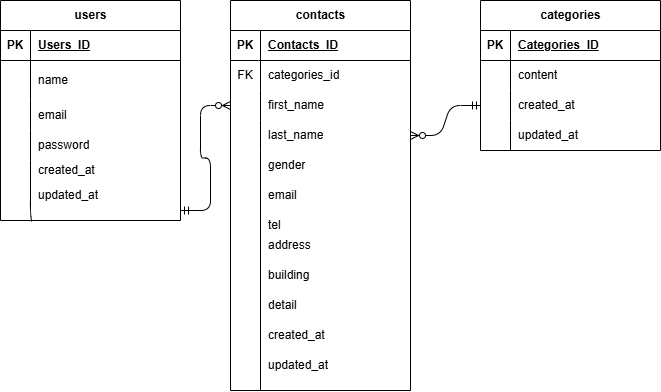

＃お問い合わせホーム
ｰｰｰ
＃＃環境構築
Dockerビルド
　1．リポジトリをクローン
 　　git clone https://github.com/a-nojiri/confirmation-test-1.git
　　cd confirmation-test-1
  2．docker-compose up -d --build
＊MySQLは、OSによって起動しない場合があるのでそれぞれのPCに合わせてdocker-compose.ymlファイルを編集して下さい。

＃＃Lalavel環境構築
　1.docker-compose exec php bash
  2.composer install
  3.cp .env.example .env
  4.php artisan key:generate
  5.php artisan migrate 
  6.php artisan db:seed
  ---
＃＃使用技術(実行環境)
  ･PHP 8.0
　･Laravel 8.x
　･MySQL 8.0
　･Docker
　･Nginx
　ｰｰｰ
＃＃ER図
　
ｰｰｰ
＃＃URL
　･開発環境： http://localhost
　･phpMyAdmin（http://localhost:8080）
