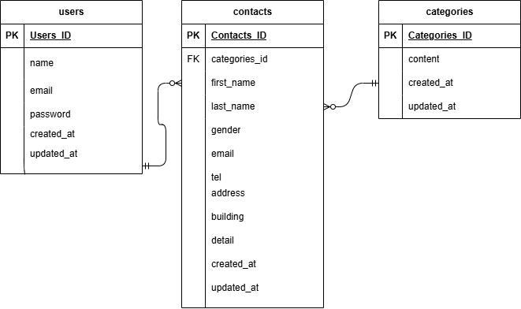

# お問い合わせホーム

---

## 環境構築

### Dockerビルド

1. リポジトリをクローン：

    ```bash
    git clone https://github.com/a-nojiri/confirmation-test-1.git
    cd confirmation-test-1
    ```

2. Dockerを起動：

    ```bash
    docker-compose up -d --build
    ```

※ MySQLは、OSによって起動しない場合があるので、それぞれのPCに合わせて `docker-compose.yml` ファイルを編集してください。

---

### Laravel構築

1. コンテナに入る：

    ```bash
    docker-compose exec php bash
    ```

2. Laravelの初期設定：

    ```bash
    composer install
    cp .env.example .env
    php artisan key:generate
    php artisan migrate
    php artisan db:seed
    ```

---

## 使用技術（実行環境）

- PHP 8.0  
- Laravel 8.x  
- MySQL 8.0  
- Docker  
- Nginx

---

## ER図



---

## URL

- 開発環境：[http://localhost](http://localhost)  
- phpMyAdmin：[http://localhost:8080](http://localhost:8080)
